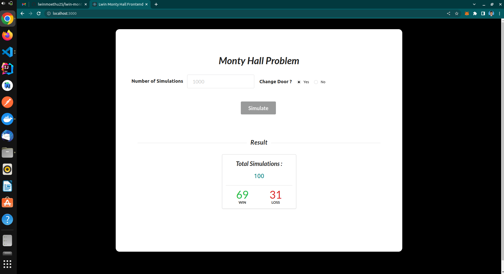
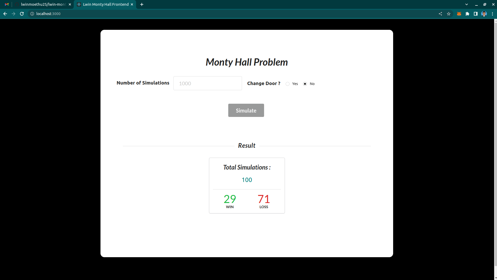
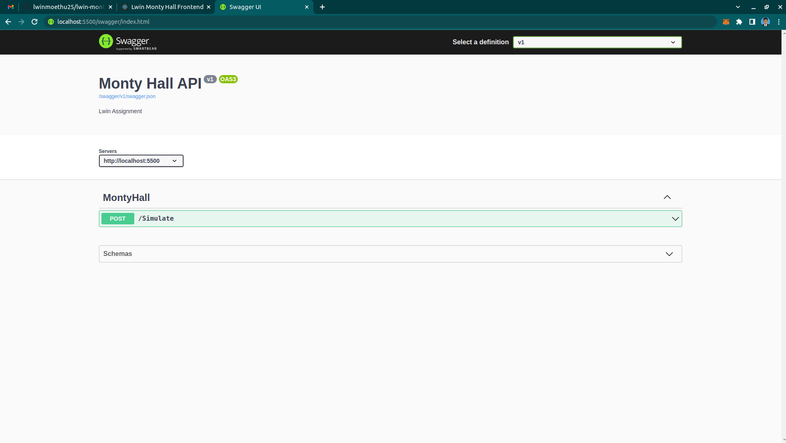
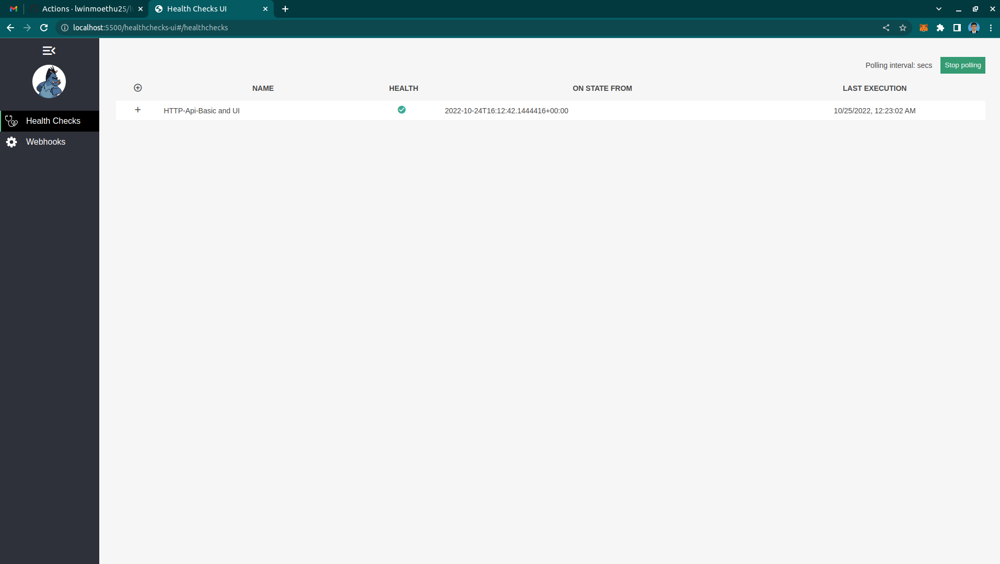

# LWIN MONTY HALL ASSIGNMENT

### Tech Stack
* Backend (.Net 6 API, Swagger, HealthCheck UI, Xunit)
* Frontend(React + Typescript + Axios + Rxjs + Semantic UI)
* Docker Containerization

### Getting Started

```
git clone https://github.com/lwinmoethu25/lwin-monty-hall.git
cd ./lwin-monty-hall/
```

### Run in Docker Container
```
sh start.sh
```

### Browse Application
```
http://localhost:3000
```





### Swagger
http://localhost:5500/swagger/index.html



### Health Check UI
http://localhost:5500/healthchecks-ui


